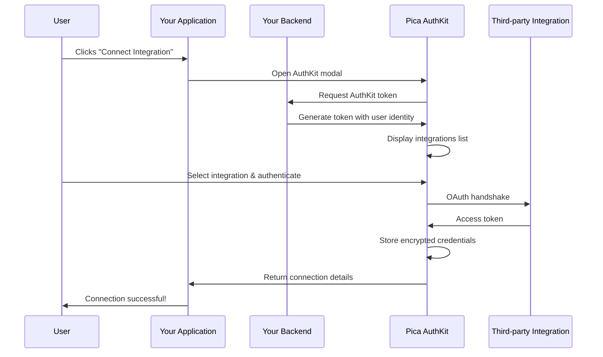

# authkit-token

[](https://npmjs.com/package/@picahq/authkit-token)

Secure token generation for [Pica's AuthKit](https://docs.picaos.com/authkit) using Node.js.

## Install

With npm:

```jsx
npm i @picahq/authkit-token
```

With yarn:

```jsx
yarn add @picahq/authkit-token
```

## Creating a token endpoint

You'll want to create an internal endpoint that's used to generate secure tokens for your frontend. You can do so by adding code that looks like the below snippet.

```jsx
import { AuthKitToken } from "@picahq/authkit-token";

app.post("/authkit-token", async (request, response) => {
  const authKitToken = new AuthKitToken("sk_live_1234");
  const token = await authKitToken.create();

  response.send(token);
});
```

You can get your API key from the [Pica dashboard](https://dashboard.picaos.com/settings/api-keys).

If you pass an `identity` or `identityType` (`user`, `team`, `organization`, or `project`), you'll be able to query for all connections scoped to that identity. The identity is used to generate the unique Connection Key for the user once they successfully connect an account.

## Frontend Implementation

To implement the AuthKit component in your frontend, you'll need to use the `@picahq/authkit` package. It's fully compatible with popular frameworks such as React, Next.js, Vue, Svelte, and more.

- **NPM package**: https://www.npmjs.com/package/@picahq/authkit
- **Documentation**: https://docs.picaos.com/authkit
- **Setup guide**: https://docs.picaos.com/authkit/setup

## Diagram



## Full Documentation

Please refer to the official [Pica AuthKit](https://docs.picaos.com/authkit) docs for a more holistic understanding of AuthKit.

## License

GPL-3.0
